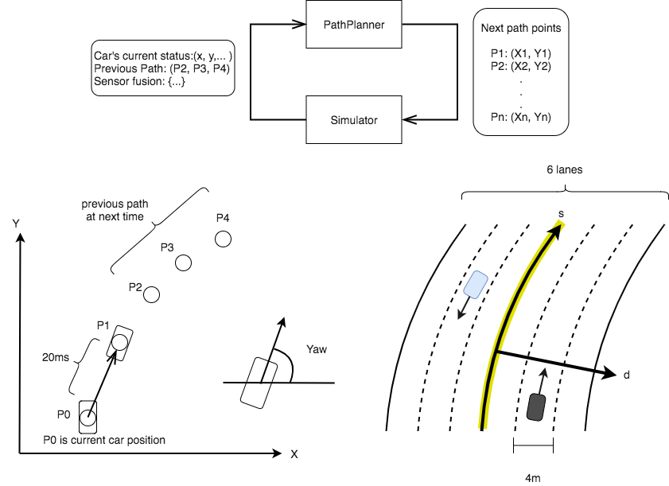

# Path Planning Project

This is a writeup for Path Planning Project.

## About the Project

The goal of this project is to make a car go around the given course with satisfying the following rules.

## Structure of Code

## Model Documentation

This model based on the lecture walkthrough approach where paths are created by spline curve. The strategy is described in the followings.

### 1. Path Generation

Spline curve is a smooth curve which go through the given points called control points. In order to draw a good spline curve, I should select appropriate control points which are selected from previous path points and waypoints. In this model, five control points are selected in the following ways.

First, The last two points of the previous path, which are given by the simulator, are used as first two control points. If there is no previous path points, current car position and the previous car position guessed from yaw angle are used. Second, three points are selected from the waypoints of the course. Since the waypoints are sampled at intervals of 30 m in 'Frenet Coordinates', I selected the waypoints that exist up to 90 m ahead of the car.
The Frenet Coordinate of these points are explicitly described as
$$
  (s_i, d_i) = (s_c + 30i, (l + 0.5)L_w ),
$$
where $s_i$ and $d_i$ are longitudinal and lateral coordinate of $i$-th selected waypoints. The constant $L_w$ means lane width (m) and the variable $l$ is the number of lane where $l=0, 1, 2$ are indicating the left, middle and right lanes, respectively.
Note that the $l$ is the **target** lane number and it does not always indicate the lane in which the car is running.

With letting $l_c$ the current lane number (the number of lane in which the car is running), control points which indicate a path switching lane is obtained by setting $l = l_c \pm 1$.

[] http://kluge.in-chemnitz.de/opensource/spline/

In order to define spline curves as function of $x$ coordinate, a coordinate transformation is applied. In the new coordinate, the yaw angle and potion of the last previous path point are set as the direction of $x$-axis and the origin, respectively. I use $x', y'$ variable as a new $x, y$-coordinate. Therefore, the splined curve is described by $y' = f(x')$, where $f$ is a spline function determined by control points.

After defining the spline curve from the selected five points, the next path points which will be added to the previous path are picked up from the spline curve at a certain interval. The interval $\Delta r$ is given by
$$
\Delta r = v_{\rm{ref}}\, \Delta t,
$$
where $v_{\rm{ref}}$ is the target velocity because the car velocity is determined by the interval of the path points.

In order to determine the $x', y'$ of the interval $\Delta r$, I select a curve in a small region $[0, x_a']$ in $x'$-axis and approximate the distance along the curve with the distance $r$ between $(0, 0)$ and $(x_a', f(x_a'))$, which is given by
$$
  r = \sqrt{(x_a')^2 + f(x_a')^2}.
$$
The number $N$ that the distance $r$ could contain the interval $\Delta r$ is
$$
 N = r / v_{\rm{ref}}\, \Delta t.
$$
Therefore, the interval of $x', y'$ is obtained by
$$
\begin{aligned}
  \Delta x' &= x_a'/N,\\
  \Delta y' &= f(\Delta x').
\end{aligned}
$$

Figure

Additional $i$-th path points are given by
$$
  (x_i', y_i') = (i\Delta x', f(i\Delta x'))
$$
### 2. Lane Switching.

If my car find any other car running ahead in a given threshold distance, my car will decide (1) switch lane and pass the other car, or (2) slows down and follows the ahead car.

Whenever there is no other car in a relative region of my car position, my car will switch the lane. The relative region is written by $[s_c - b, s_c + a]$ in $s$-coordinate of Frenet Coordinate, where $a$ and $b$ are parameter of the model. If large values are set for $a$ and $b$, my car will be more defensive, since my car will decide to switch lanes only the time when there is no car over a wide range region.

Figure shows that situations. In the case of Figure (a) where my car (black one) can find in right lane that there is no car in the region of $[s_c-b, s_c + a]$ while in the left region an other car (yellow one) exists, so that my car can switch the lane. On the other hand, in the case of Figure (b), the both lanes are filled by other cars. Therefore my car stays middle lane and follows the other car in front.

Figure: (A) (B)

It seems to be more advantageous that the car is driving in the middle lane rather than driving right or left lane, since the car driving middle lane has two options switching left or right. Hence, I make my car prefer to switch to middle lane if it running in right or left lane and it can switch.

Figure:
